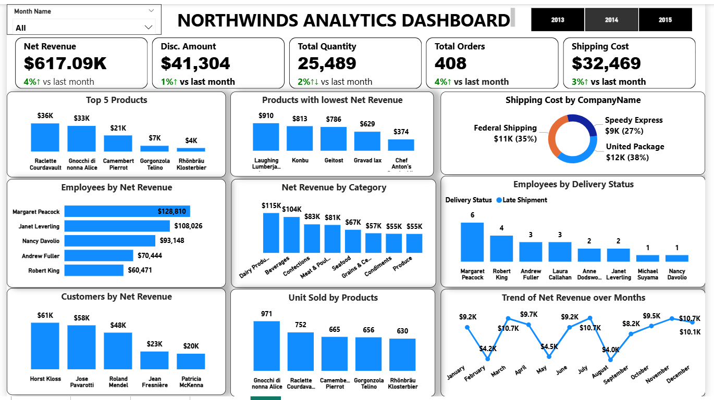

# NORTHWINDS ANALYTICS DASHBOARD

## Project Overview
This project focuses on analyzing Revenue(Gross and Net), employees, customers, products, and operational performance in real-world business data. 
The goal is to transform raw data into an actionable insights to help stakeholder to understand employees performance, identify trends and patterns 
in products purchases, including most and least purchased products and support data-driven decision-making.

---

## Objectives
- Evaluate net revenue performance to understand the true business after discounts.
- Identify Top 5 performing customers, catogory, products, employees based on net revenue contribution and transaction volumes
- Track sales montly Trends
- Identify and comparing the Shipping cost across provider
- Identify delivery status by employees, highlighting late shipment and pending assessing operational efficiency and employee performance

---

## Data Cleaning and Transformation
**Power Query in PowerBi** for data modelling,DAX measures and dashboard creation 
**SQL** for joining tables, handling missing values and detecting data anomalies

---

## Key Metrics (KPIs)
- **Net Revenue:** $1.27M
- **Discount Amount:** $88,666
- **Total Orders:** 830
- **Total Quantity:** 51,317
- **Total Product:** 77
- **Total Employees:** 830
- **Total Customers:** 830
  
---

## Dashboard Preview

  
  *Total Products:** 77
- **Discount Amount:** 88.67k
- **Total Customers:** 91
